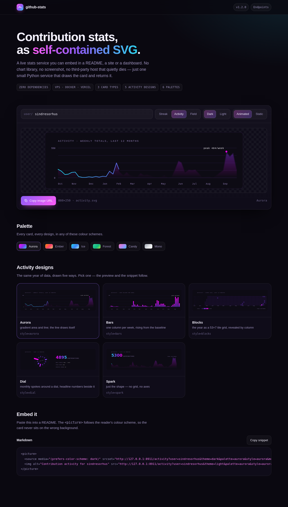
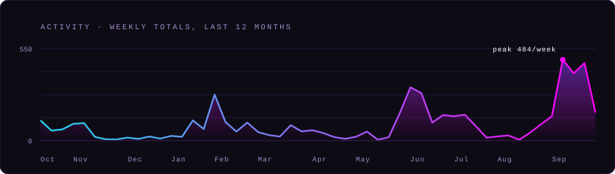
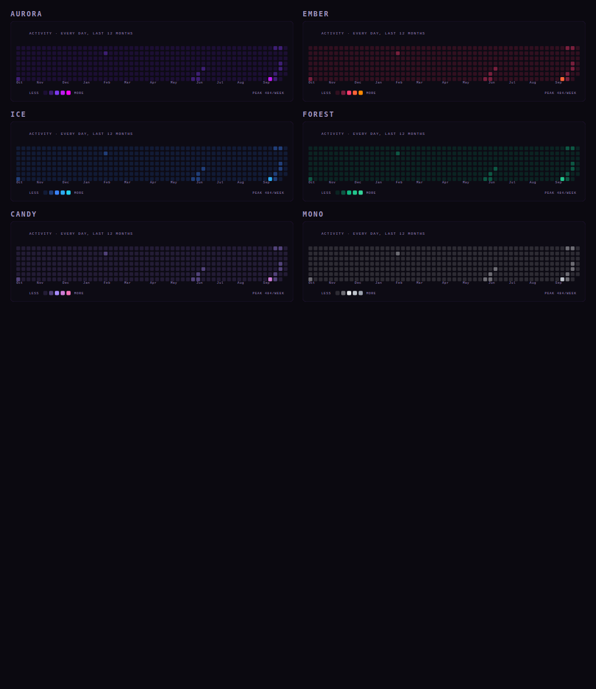
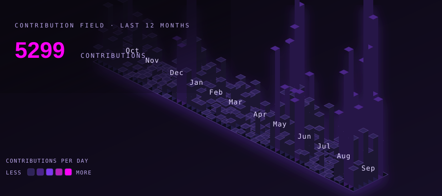
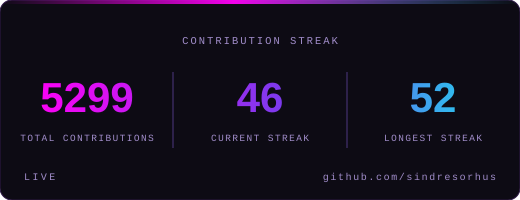

<div align="center">

# github-stats

**Live GitHub contribution stats as SVG — for any profile README.**

Type a username, choose a design and a palette, copy the snippet. Every request
re-reads GitHub, so the numbers are current: nothing to schedule, nothing to keep
in sync.

     



</div>

---

## Five activity designs

The same year of data, drawn five ways. Every design is **880×250**, so they are
drop-in interchangeable, and every one works in every palette and both themes.

<table>
<tr>
<td width="50%" valign="top">
<br>
<sub><b>Aurora</b> · <code>style=aurora</code> — the default. A gradient area with a
line that draws itself when the card loads.</sub>
</td>
<td width="50%" valign="top">
<br>
<sub><b>Bars</b> · <code>style=bars</code> — one column per week, rising from the
baseline in sequence.</sub>
</td>
</tr>
<tr>
<td width="50%" valign="top">
<br>
<sub><b>Blocks</b> · <code>style=blocks</code> — every day as a tile, 53 columns by
7 rows, revealed column by column.</sub>
</td>
<td width="50%" valign="top">
<br>
<sub><b>Dial</b> · <code>style=dial</code> — the year as monthly spokes, with the
headline numbers beside it.</sub>
</td>
</tr>
<tr>
<td width="50%" valign="top">
<br>
<sub><b>Spark</b> · <code>style=spark</code> — no grid, no axes, just the shape and
the total.</sub>
</td>
<td width="50%" valign="top"></td>
</tr>
</table>

The entrance animations are one-shot: they play once and settle, because a card in a
README is read, not watched. Add `motion=0` to freeze them entirely — and every card
is also drawn so a viewer that ignores animation still gets the finished picture,
never a half-drawn line.

## Six palettes

`palette=` takes any of **Aurora** (default), **Ember**, **Ice**, **Forest**,
**Candy** or **Mono**, and each has a dark and a light tuning — the light variants
are deepened so they hold up on a white page.



<sub>All six palettes, in the <code>Blocks</code> design, dark theme, same user.</sub>

## The other two cards

### Contribution field — `/field?user=NAME`

Every day of the last year as an isometric tile. Height and colour both encode that
day's count; columns are drawn back-to-front so nearer tiles overlap farther ones,
and heights are normalised to the year's busiest day so a 4-commit day and a
400-commit day are both legible on the same canvas.

<p align="center">
  <picture>
    <source media="(prefers-color-scheme: dark)" srcset="assets/example-field.svg">
    <source media="(prefers-color-scheme: light)" srcset="assets/example-field-light.svg">
    
  </picture>
</p>

### Streak — `/streak?user=NAME`

Totals, current streak and longest streak. A zero on the final day reads as "today
is not over yet" rather than the end of a streak, which is what a reader expects to
see mid-morning.

<p align="center">
  <picture>
    <source media="(prefers-color-scheme: dark)" srcset="assets/example-streak.svg">
    <source media="(prefers-color-scheme: light)" srcset="assets/example-streak-light.svg">
    
  </picture>
</p>

<sub>Every example on this page is committed output for <code>sindresorhus</code> —
real renders, not mockups.</sub>

## Quick start

```bash
# no install: just ask a deployment
curl "https://YOUR-HOST/streak?user=NAME" -o streak.svg

# or run it yourself — standard library only, nothing to pip install
python3 server.py --port 8000
# then open http://localhost:8000/?user=torvalds
```

## Endpoints

| Route | Returns |
| --- | --- |
| `/?user=NAME` | the web UI — preview every card, design and palette, then copy the embed |
| `/streak?user=NAME` | total contributions, current streak, longest streak |
| `/activity?user=NAME` | weekly totals over the last twelve months — five designs |
| `/field?user=NAME` | the isometric 3-D contribution field |

| Parameter | Values | Default | Notes |
| --- | --- | --- | --- |
| `user` | any GitHub username | *required* | the service is generic — there is no default user |
| `theme` | `dark`, `light` | `dark` | accepted by every route |
| `palette` | `aurora`, `ember`, `ice`, `forest`, `candy`, `mono` | `aurora` | accepted by every route |
| `style` | `aurora`, `bars`, `blocks`, `dial`, `spark` | `aurora` | `/activity` only |
| `motion` | `1`, `0` | `1` | `0` freezes the entrance animation |

An unknown palette or style falls back to the default rather than erroring, so a typo
in a README degrades to a working card.

Cards return `image/svg+xml`, the UI returns `text/html`, and CORS is open to every
origin. Responses are cached 5 minutes in the browser and 10 at the edge with
stale-while-revalidate: fresh enough to call live, polite enough that a profile view
never hammers GitHub.

## Embed

```html
<p align="center">
  <picture>
    <source media="(prefers-color-scheme: dark)"  srcset="https://YOUR-HOST/activity?user=NAME&theme=dark&palette=aurora&style=aurora">
    <source media="(prefers-color-scheme: light)" srcset="https://YOUR-HOST/activity?user=NAME&theme=light&palette=aurora&style=aurora">
    
  </picture>
</p>
```

Swap `/activity` for `/streak` or `/field`, and `style=` for any of the five designs.
The web UI builds this snippet for you, already pointing at the right host and
carrying whatever you picked — the page is deep-linkable, so the whole view
(`?user=`, `theme=`, `palette=`, `style=`, `kind=`, `motion=`) can be shared as a URL.

## Deploy

A standard-library WSGI app, so it runs anywhere Python 3.9+ runs. Pick whatever you
already have.

| Host | How | Time |
| --- | --- | --- |
| **Vercel** | import the repo, framework "Other", deploy | ~1 min |
| **Docker** | `docker compose up -d` | ~1 min |
| **VPS** | `python3 server.py --port 8000` + the unit below | ~2 min |
| **Any PaaS** | point it at `server.py`, or the WSGI callable `github_stats.wsgi` | — |

<details>
<summary><b>Docker</b></summary>

```bash
docker build -t github-stats .
docker run -d -p 8000:8000 --name github-stats github-stats
```

Or `docker compose up -d` (see `docker-compose.yml`). The image is
`python:3.12-alpine`, runs as a non-root user and has a healthcheck.
</details>

<details>
<summary><b>VPS, bare Python</b></summary>

```bash
python3 server.py --host 0.0.0.0 --port 8000
```

Put nginx or Caddy in front, and use a unit like this to survive a reboot:

```ini
# /etc/systemd/system/github-stats.service
[Unit]
Description=github-stats
After=network-online.target

[Service]
WorkingDirectory=/opt/github-stats
ExecStart=/usr/bin/python3 server.py --host 127.0.0.1 --port 8000
Restart=always
User=www-data

[Install]
WantedBy=multi-user.target
```
</details>

<details>
<summary><b>Vercel</b></summary>

Import this repository, choose **Other** as the framework if asked, then deploy.
`api/index.py` is detected as a Python function and `vercel.json` maps the pretty
paths. No environment variables to set.
</details>

## Configuration

None required — that is rather the point. Optional: set `GH_TOKEN` (or
`GITHUB_TOKEN`) so the service can fall back to the GitHub GraphQL API when the
public calendar page cannot be parsed. It is only ever a fallback, so everything
works without it.

## How it works

`render(path, query)` is a pure function of the URL: it returns
(status, content-type, body). Every host adapter is a thin wrapper around it, which
is why this is not Vercel-only.

```
browser / README
        │  /activity?user=NAME&style=dial&palette=ice
        ▼
  github_stats.app.render ────► github_stats.github.fetch_calendar
        │                              │
        │                              ├─ github.com/users/NAME/contributions  (public, no auth)
        │                              └─ api.github.com/graphql              (only if GH_TOKEN)
        ▼
  github_stats.styles · cards · field ────► image/svg+xml
```

```
github_stats/
  app.py       router, WSGI app, serverless handler
  palettes.py  colour: base surfaces, the six palettes, derived ramps
  styles.py    the five activity designs
  cards.py     the streak card
  field.py     the isometric contribution field
  github.py    calendar fetch and parse
  stats.py     totals, streaks, weekly buckets
  webui.py     the landing page
  errors.py    drawn failure cards
  config.py    geometry and cache policy
api/index.py   Vercel shim (puts the repo root on sys.path, re-exports the app)
server.py      VPS / container entrypoint (wsgiref)
```

Three things worth calling out:

- **No token.** The calendar is read from `github.com/users/<user>/contributions` —
  the same public HTML GitHub renders on every profile. `data-date` gives the day
  and the tool-tip text gives the count. Nothing to leak, nothing to rotate.
- **Errors are drawn, not thrown.** A failure returns a card of the expected size
  with HTTP 200, so an embed in someone's profile README never shows a
  broken-image icon.
- **Colour and geometry are separate.** A design knows nothing about colour and a
  palette knows nothing about layout, so five designs and six palettes multiply out
  with no per-combination code.

## License

MIT
